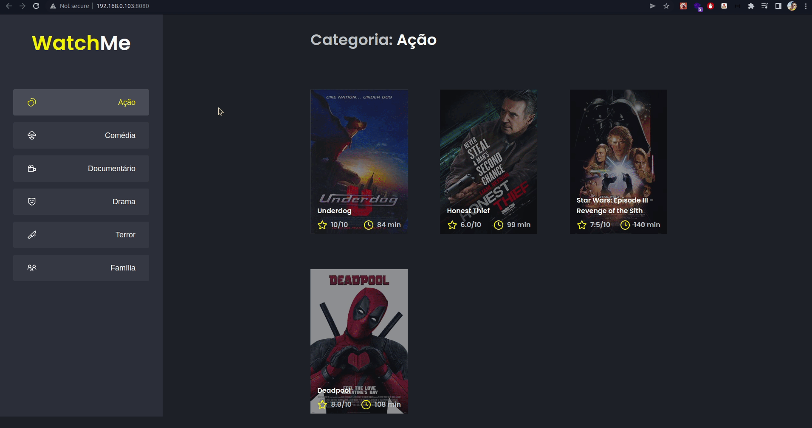

<p align="center">
    
    
</p>

> Segundo desafio da trilha de React do Ignite da [Rocketseat](https://github.com/Rocketseat). O projeto consiste em listar filmes de uma API fake, utilizando o JSON Server e componentização de toda a aplicação.
# :construction_worker: Rodando o projeto

```bash
# Clone o Repositório
$ git@github.com:ericlys/Desafio-02-ignite-componentizando-a-aplicacao.git
```

```bash
# Instalar as dependendências
$ yarn
```

```bash
# Rodar a api fake do JSON Server, iniciando o servidor na porta 3333:
$ yarn server
```

```bash
# Execute o projeto em outro terminal
$ yarn dev
```

_Obs.: Lembre de deixar o JSON Server rodando, por isso utilize outro terminal para executar o projeto._

Acesse <http://localhost:8080> para ver o resultado.
